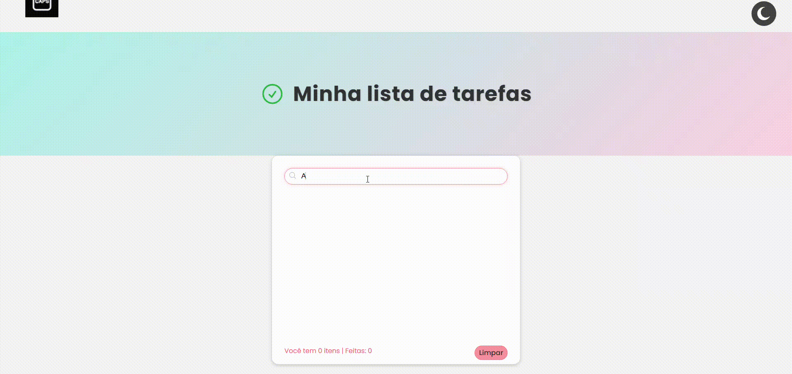

# Lista de Tarefas 📄

## Sobre o projeto
Este é um aplicativo de lista de tarefas que permite organizar suas atividades diárias de forma prática. Ele possui alternância entre tema claro e escuro e permite adicionar até 8 tarefas. Para marcar uma tarefa como concluída, basta clicar sobre ela, e ela será riscada. Cada tarefa também possui opção de exclusão, acessível pelos três pontinhos. Abaixo da lista, é exibida a quantidade de itens adicionados e o total máximo, junto com um botão para limpar todas as tarefas concluídas.

## Desafios
O maior desafio deste projeto foi adicionar itens dinamicamente na lista 'ul' via JavaScript. Achei incrível perceber como o JS manipula o DOM, permitindo criar elementos que não existiam no HTML inicialmente. Esse exercício foi excelente para praticar e entender melhor o poder do JavaScript em projetos práticos.

## Projeto no ar
Acesse a versão online do [projeto.](https://luciane003.github.io/Lista-de-tarefas/)

## Funcionalidades
- Código limpo e organizado
- Responsivo para diferentes tamanhos de tela
- Alternância de tema claro/escuro
- Adição e exclusão de tarefas individualmente
- Controle da quantidade máxima de tarefas e acompanhamento das concluídas
- Botão para limpar todas as tarefas concluídas
- Desenvolvido com HTML, CSS e JavaScript

## Tecnologias usadas

  
  
  

 

## Como visualizar o projeto localmente
### Clonar o repositório
git clone https://github.com/luciane003/Lista-de-tarefas.git
### Abra o arquivo index.html no navegador

## Visualização

## Autora 
-  Luciane Kellen
- Feito como parte do meu processo de aprendizagem.

  
  
  

